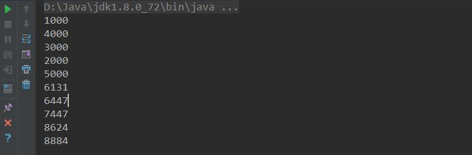

# 多线程 #

------


# 一、多线程基本概念

1. 线程与进程
2. 为什么要使用多线程
3. 多线程的应用场景
4. 多线程的创建方式
5. 练习题
6. 线程的生命周期
7. 面试总结

## 1、线程与进程的区别

​		**每个正在系统上运行的程序都是一个进程。每个进程包含一到多个线程。**线程是一组指令的集合，或者是程序的特殊段，它可以在程序里独立执行。也可以把它理解为代码运行的上下文。所以**线程基本上是轻量级的进程**，它负责在单个程序执行多任务。通常由操作系统负责多个线程的调度和执行。

​		使用线程可以把占据时间长的程序中的任务放到后台去处理，程序的运行速度可能加快，在一些等待的任务实现上如用户输入、文件读写和网络收发数据等，线程就比较有用了。在这种情况下，可以释放一些珍贵的资源如内存占用等等。

​		如果有大量的线程，会影响性能，因为操作系统需要在它们之间切换，更多的线程需要更多的内存空间，线程的中止需要考虑其对程序运行的影响。通常块模型数据是在多个线程间共享的，需要防止线程死锁情况的发生。

**总结：<u>进程是所有线程的集合，每个一个线程是进程中的一条执行路径。</u>**

## 2、为什么要使用多线程？

**多线程的好处就是 提高程序的效率。**

## 3、多线程的应用场景

主要能体现多线程提高程序效率。

**举例：迅雷多线程下载、分批发送短信等。**

## 4、多线程的创建方式

### （1）.继承Thread类，重写run()方法。

```java
/**
 * Created by Li Xiaochang on 2019/08/17-18:30.
 * 创建线程的方式一：继承Thread类
 */
public class Thread1 extends Thread {
    @Override
    public void run() {
        for (int i = 0; i < 100; i++) {
            System.out.println("i = "+i);
        }
    }
}
```


### （2）.实现Runnable接口，重写run()方法。

```
/**
 * Created by Li Xiaochang on 2019/08/17-18:31.
 * 创建线程的方式二：实现Runnable接口
 */
public class Thread2 implements Runnable {
    @Override
    public void run() {
        for (int i = 0; i < 100; i++) {
            System.out.println("i = " + i);
        }
    }
}
```


### （3）.使用匿名内部类方式

```java
new Thread(new Runnable() {
            @Override
            public void run() {
                for (int i = 0; i < 100; i++) {
                    System.out.println("i = "+i);
                }
            }
        }).start();
```


### （4）.使用继承Thread类还是使用实现Runnable接口好？

实现Runnable接口好，因为实现了接口还可以继续继承。继承Thread类不能再继承。（Java属于单继承）

### （5）.启动线程是调用start()还是run()方法？

开始执行线程 注意 开启线程不是调用run方法，而是**start方法**

调用run知识使用实例调用方法。

## 5、获取线程对象以及名称

| **常用线程****api****方法**      |                                                    |
| -------------------------------- | -------------------------------------------------- |
| start()                          | 启动线程                                           |
| currentThread()                  | 获取当前线程对象                                   |
| getID()                          | 获取当前线程ID      Thread-编号  该编号从0开始     |
| getName()                        | 获取当前线程名称                                   |
| sleep(long mill)                 | 休眠线程                                           |
| Stop（）                         | 停止线程                                           |
| **常用线程构造函数**             |                                                    |
| Thread（）                       | 分配一个新的 Thread 对象                           |
| Thread（String name）            | 分配一个新的 Thread对象，具有指定的 name正如其名。 |
| Thread（Runable r）              | 分配一个新的 Thread对象                            |
| Thread（Runable r, String name） | 分配一个新的 Thread对象                            |

## 6、多线程运行状态


线程从创建、运行到结束总是处于下面五个状态之一：新建、就绪、运行、阻塞和死亡状态。

### （1）新建状态

当用new操作符创建一个线程时，如new Thread();线程还没开始执行，此时线程处在新建状态，当一个线程处于新生状态时，程序还没有开始运行线程中的代码。

### （2）就绪状态

​		一个新创建的线程并不自动开始运行，要执行线程，必须调用线程的start方法。当线程对象调用start()后，方法即启动了线程，start方法创建线程运行的系统资源，并调度线程运行run方法，当start方法返回后，线程就属于就绪状态。

​		处于就绪状态的线程并不一定立即运行run方法，线程还必须同其他线程竞争CPU时间，只有获得CPU时间才可以运行线程。因为在单CPU的计算系统中，不可能同时运行多个线程，一个时刻仅有一个线程处于运行状态，对于多个处于运行状态的线程是由Java运行时系统的线程调度程序（Thread Scheduler）来调度的。

### （3） 运行状态

当线程获得CPU时间后，它才进入运行状态，真正开始执行run()方法。

### （4）阻塞状态

线程运行过程中，可能由于各种原因进入阻塞状态：

1. 线程通过调用**sleep方法**进入睡眠状态；
2. 线程通过调用一个在**I/O上被阻塞的操作**，即该操作在输入输出操作完成之前不会返回到它的调用者；
3. 线程试图**得到一个锁**，而该锁正在被其他线程持有；
4. 线程在**等待某个触发**条件。

### （5） 死亡状态

有两个原因会导致线程死亡：

1. **run方法正常退出而自然死亡；**
2. **一个未捕获的异常终止了run方法而使得线程猝死。**     

为了确定线程在当前是否还存活着（就是要么是可运行的、要么是被阻塞了），需要使用isAlive()方法。如果是可运行或被阻塞，这个方法返回true；如果线程仍旧是new 状态且不是可运行的，或者线程死亡了，则返回false。

## 7、多线程分批处理数据

**需求：**目前某司有十万个用户，现在某司需要做活动，给每一个用户发送一条祝福短信。

**为了提高程序的效率，使用多线程技术分批发送数据；**

**每开一个线程都会占用CPU资源**

**服务器（电脑）配置CPU内核**

**实现：**


## 8、面试题

- 进程与线程的区别？

  **进程是所有线程的集合，每一个线程是进程中的一条执行路径，线程只是一条执行路径。**

- 为什么要用多线程？

  **提高程序效率。**

- 多线程创建方式？

  **继承Thread类；实现Runnable接口；使用匿名内部类方式。**

- 是继承Thread类好还是实现Runnable接口好？

  **实现Runnable接口好，因为实现了接口还可以继续继承。继承Thread类不能再继承。（Java属于单继承）**

- 你在哪里用到了多线程？

  **主要能体现多线程提高程序效率。**

  **举例：迅雷多线程下载、分批发送短信等。**

# 二、多线程之间实现同步

- 理解线程安全
- synchronized用法
- 死锁
- **分布式锁**

## 1、什么是线程安全

1. 为什么有线程安全问题？

   当多线程同时共享，**同一个全局变量或静态变量**，做**写操作**时，可能会发生数据冲突问题，也就是线程安全问题。但是做读操作是不会发生数据冲突问题。

   **案例：**需求现在有100张火车票，有两个窗口同时抢火车票，请使用多线程模拟抢票效果。

   ```java
 public class ThreadTrain implements Runnable {
   
    private int count = 100;
   
       @Override
       public void run() {
           while(count > 0){
               System.out.println(Thread.currentThread().getName()+"==出售第"+(100-count+1)+"张票。");
               count --;
           }
       }
   }
   ```
   
   **结论：多个线程共享一个全局成员变量时，做写操作可能恢复发生数据冲突问题。**


## 2、线程安全解决办法

- **如何解决多线程之间线程安全问题？**

  使用多线程之间同步或使用lock锁。

- **为什么使用线程同步或使用锁能解决线程安全问题呢？**

  将可能发生数据冲突（线程不安全问题），只能让当前一个线程进行执行。代码执行完成后释放锁，然后才能让其他线程进行执行，这样的话酒而已解决线程不安全问题。

- **什么是多线程之间同步？**

  当多个线程共享同一个资源，不会受到其他线程的干扰。


1. **使用同步代码块**

   什么是同步代码块？

   ​	就是将可能会发生线程安全问题的代码，给包括起来。

   ​	synchronized(同一数据){

   ​		//要同步的代码

   ​	}

   代码：

   ```java
   private Object obj = new Object();
   
       public void sale(){
           synchronized (obj) {
               if (count > 0) {
                   try {
                       Thread.sleep(40);
                   } catch (Exception e) {
                       e.printStackTrace();
                   }
                   System.out.println(Thread.currentThread().getName() + "==出售第" + (100 - count + 1) + "张票。");
                   count--;
               }
           }
       }
   ```

2. **同步函数**

   什么是同步函数？

      在方法上修饰synchronized 称为同步函数。

   代码：

   ```java
   public synchronized void sale2(){
           if (count > 0) {
               try {
                   Thread.sleep(40);
               } catch (Exception e) {
                   e.printStackTrace();
               }
               System.out.println(Thread.currentThread().getName() + "==出售第" + (100 - count + 1) + "张票。");
               count--;
           }
       }
   ```

   使用：

   ```java
    @Override
       public void run() {
           while (count > 0){
   //            sale();
               sale2();
           }
       }
   ```

   **思考：同步函数用的是什么锁？**

   同步函数使用this锁。

   证明方式: 一个线程使用同步代码块(this明锁),另一个线程使用同步函数。如果两个线程抢票不能实现同步，那么会出现数据错误。

   代码：

   ```java
   public class ThreadTrain implements Runnable {
   
       private int count = 100;
   
       public boolean flag = true;
   
       @Override
       public void run() {
           if (flag) {
               while (true) {
                   sale();
               }
           }else{
               while (true) {
                   sale();
               }
           }
       }
   
       private Object obj = new Object();
   
       public void sale() {
           synchronized (obj) {
               if (count > 0) {
                   try {
                       Thread.sleep(40);
                   } catch (Exception e) {
                       e.printStackTrace();
                   }
                   System.out.println(Thread.currentThread().getName() + "==出售第" + (100 - count + 1) + "张票。");
                   count--;
               }
           }
       }
   
       public synchronized void sale2() {
           if (count > 0) {
               try {
                   Thread.sleep(40);
               } catch (Exception e) {
                   e.printStackTrace();
               }
               System.out.println(Thread.currentThread().getName() + "==出售第" + (100 - count + 1) + "张票。");
               count--;
           }
       }
   }
   
   //run所在类
    public boolean flag = true;
   
       @Override
       public void run() {
           if (flag) {
               while (count > 0) {
                   sale();
               }
           }else{
               while (count > 0) {
                   sale();
               }
           }
       }
   ```

   

3. **静态同步函数**

   什么是静态同步函数？

   方法上加上static关键字，使用**synchronized 关键字修饰** 或者 使用**类.class文件**。

   静态的同步函数使用的锁是  **该函数所属字节码文件对象** ，可以用 **getClass()**方法获取，也可以用当前  **类名.class** 表示。

   代码：
   
   ```
   public void sale3(){
           synchronized (ThreadTrain.class){
               if (count > 0) {
                   try {
                       Thread.sleep(40);
                   } catch (Exception e) {
                       e.printStackTrace();
                   }
                   System.out.println(Thread.currentThread().getName() + "==出售第" + (100 - count + 1) + "张票。");
                   count--;
               }
           }
       }
   ```
   
   ```java
   public static synchronized void sale4() {//此时注意将count使用static修饰
           if (count > 0) {
               try {
                   Thread.sleep(40);
               } catch (Exception e) {
                   e.printStackTrace();
               }
               System.out.println(Thread.currentThread().getName() + "==出售第" + (100 - count + 1) + "张票。");
               count--;
           }
       }
   ```
   
   

**总结：synchronized修饰方法使用锁是 当前this锁。**

​			**synchronized修饰静态方法使用锁是 当前类的字节码文件。**

## 3、多线程死锁

1. 什么是多线程死锁？

   同步中嵌套同步，导致锁无法释放。

   代码：
   
   ```java
   public class ThreadTrain2 implements Runnable {
   
       private int count = 100;
   
       public boolean flag = true;
   
       private Object obj = new Object();
   
       @Override
       public void run() {
           if (flag) {
               while (true) {
                   synchronized (obj) {
                       /**
                        *  锁（同步代码块）在什么时候释放？——代码执行完，自动释放锁。
                        *  flag==true：先拿到 obj锁，再拿到 this锁 才能执行。
                        *  flag==false：先拿到this锁，再拿到obj锁 才能执行。
                        */
                       sale();
                   }
               }
           } else {
               while (true) {
                   sale();
               }
           }
   
       }
   
       public synchronized void sale() {
           synchronized (obj) {
               if (count > 0) {
                   try {
                       Thread.sleep(40);
                   } catch (Exception e) {
                       e.printStackTrace();
                   }
                   System.out.println(Thread.currentThread().getName() + "==出售第" + (100 - count + 1) + "张票。");
                   count--;
               }
           }
       }
   
   }
   
   public static void main(String[] args) throws Exception{
   
           ThreadTrain threadTrain2 = new ThreadTrain();
   
           Thread t = new Thread(threadTrain2);
           Thread t2 = new Thread(threadTrain2);
           t.start();
           Thread.sleep(40);
           threadTrain2.flag = false;
           t2.start();
   
      }
   ```
   
   

## 4、练习题

**设计4个线程，其中两个线程每次对j增加1，另外两个线程对j每次减少1。写出程序。**

代码：

```
/**
 * Created by Li Xiaochang on 2019/08/18-11:37.
 * 设计4个线程，其中两个线程每次对j增加1，另外两个线程对j每次减少1。写出程序。
 */
public class ThreadExer {
    public static void main(String[] args) {

        ThreadExer exer = new ThreadExer();
        Inc inc = exer.new Inc();
        Dec dec = exer.new Dec();
        Thread t1 = new Thread(inc);
        Thread t2 = new Thread(inc);
        Thread t3 = new Thread(dec);
        Thread t4 = new Thread(dec);

        t1.start();
        t2.start();
        t3.start();
        t4.start();

    }

    private int j = 0;

    public synchronized void inc() {
        j++;
        System.out.println(Thread.currentThread().getName()+"-inc:"+j);
    }

    public synchronized void dec() {
        j--;
        System.out.println(Thread.currentThread().getName()+"-dec:"+j);
    }

    class Inc implements Runnable {

        @Override
        public void run() {
            inc();
        }
    }

    class Dec implements Runnable {
        @Override
        public void run() {
            dec();
        }
    }
}

//每次的运行结果会不一样的喔！！！
```


## 5、面试题

1. **什么是多线程安全？**

   当多个线程同时共享 **同一个全局变量或静态变量**，做写操作时，可能会发生数据冲突问题，也就是线程安全问题。做读操作是不会发生数据冲突问题。

2. **如何解决多线程之间线程安全问题？**

   使用多线程之间**同步**或使用**锁（lock）**。

3. **为什么使用线程同步或使用锁能解决线程安全问题呢？**

   将可能会发生数据冲突问题（线程不安全问题），只能让当前一个线程进行执行。被包裹的代码执行完成后释放锁，然后才能让其他线程进行执行。这样的话就可以解决线程不安全问题。

4. **什么是多线程之间同步？**

   当多个线程共享一个资源，不会受到其他线程的干扰。

5. **什么是同步代码块？**

   就是将可能发生线程安全问题的代码给包括起来。只能让当前一个线程进行执行，被包裹的代码执行完成之后才能释放锁，然后才能让其他线程进行执行。

6. **多线程同步的分类？**

   - 使用同步代码块

     `synchronized(同一个数据){`

     ​	可能会发生线程冲突问题

     }

   - 使用同步函数

     在方法上修饰synchronized称为同步函数。

   - 静态同步函数

     方法上加上**static**关键字，使用**synchronized**关键字修饰 为静态同步函数。静态的同步函数使用的锁是 **该函数所属字节码文件对象**。

7. **同步代码块与同步函数区别？**

   同步代码使用自定锁（明锁）

   同步函数使用this锁

8. **同步函数与静态同步函数区别？**

   （或者 例如现在有一个静态方法和一个非静态方法，怎么实现同步？）

   同步函数使用this锁；静态同步函数使用字节码文件，也就是类class。

9. **什么是多线程死锁？**

   同步中嵌套同步

   解决办法：同步中尽量不要嵌套同步。


## 6、注意：

**在run方法当中不能抛出异常，只能try。**
**sleep作用让当先线程从运行状态变为休眠状态，如果时间到期有会到运行状态。sleep 不能释放锁，多线程之间实现同步。**


# 三、多线程之间实现通讯

- **多线程之间如何通讯**
- **wait()、notify()、notifyAll()方法**
- **lock**
- **停止线程**
- **守护线程**
- **join()方法**
- **优先级**
- **yield()方法**
- **线程池、Java内存模型、ThreadLock、VLO**

## 1、什么是多线程之间通讯？

多线程之间通讯，其实就是多个线程在操作同一个资源，但是操作的动作不同。

## 2、多线程之间通讯需求

需求：第一个线程写入（input）用户，另一个线程读取（out）用户，实现读一个，写一个操作。


## 3、代码实现

1. 共享资源实体

   ```java
   class Res {
       public String userSex;
       public String userName;
       //线程通讯表示
       public boolean flag = false;
   }
   ```

   

2. 输入线程资源

   ```java
   //输入线程
   class InThread extends Thread {
       private Res res;
       public InThread(Res res) {
           this.res = res;
       }
       @Override
       public void run() {
           int count = 0;
           while (true) {
             if (count == 0) {
                 res.userName = "李小昌";
                 res.userSex = "女";
             } else {
                 res.userSex = "男";
                 res.userName = "杰瑞";
             }
               //求奇数偶数算法
               count = (count + 1) % 2;
           }
       }
   }
   ```

   

3. 输出线程

   ```java
   //输出线程
   class OutThread extends Thread {
       private Res res;
       public OutThread(Res res) {
           this.res = res;
       }
       @Override
       public void run() {
           while(true){
              System.out.println(res.userSex+"---"+res.userName);
           }
       }
   }
   ```

   

4. 运行

   ```java
   public static void main(String[] args) {
           Res res = new Res();
           InThread in = new InThread(res);
           OutThread out = new OutThread(res);
           in.start();
           out.start();
       }
   ```

   

5. 结果

   

6. 解决线程安全问题
   - IntThread 加上synchronized

     ```java
     @Override
     public void run() {
         int count = 0;
         while (true) {
             synchronized (res){
                 if (count == 0) {
                     res.userName = "李小昌";
                     res.userSex = "女";
                 } else {
                     res.userSex = "男";
                     res.userName = "杰瑞";
                 }
                 //求奇数偶数算法
                 count = (count + 1) % 2;
             }
         }
     }
     ```

     

   - 输出线程加上synchronized

     ```java
     @Override
     public void run() {
         while(true){
             synchronized (res){
                 System.out.println(res.userSex+"---"+res.userName);
             }
         }
     }
     ```

     

## 4、wait() notify() notifyAll() 方法

wait() notify() notifyAll() 是三个定义在Object类里的方法，可以用来控制线程的状态。这三个方法最终调用的都是JVM级的native方法。随着JVM运行平台的不同可能有些许差异。

- 如果对象调用了wait()方法就会使 持有该对象的线程 把该对象的控制权交出去，然后处于等待状态。
- 如果对象调用了notify()方法，就会通知某个正在等待这个对象的控制权的线程可以继续运行。
- 如果对象调用了notifyAll()方法，就会通知所有等待这个对象控制权的线程继续运行。

## 5、wait() 和 sleep() 区别

对于sleep()方法，我们首先要知道该方法是属于Thread类中的。而wait()方法属于Object类中的。

sleep()方法导致了**程序暂停执行指定的时间**，让出CPU给其他线程，但是他的监控状态依然保持着，**当指定的时间到了又会自动恢复运行状态**。

**在调用sleep()方法过程中，线程不会释放对象的锁。**

**在调用wait()方法时，线程会放弃对象锁**，进入等待此对象的等待锁定池，只有针对此对象调用**notify() 或 notifyAll()**方法后本县城才进入对象锁定池准备。**获取对象锁进入运行状态。**

## 6、JDK1.5 Lock

在JDK1.5之后，并发包中新增了**Lock**接口（以及相关实现类）用来实现锁功能，Lock接口提供了与synchronized关键字类似的同步功能，但是需要在使用时**手动获取锁和释放锁**。

1. **Lock写法**

   ```java
   import java.util.concurrent.locks.Lock;
   import java.util.concurrent.locks.ReentrantLock;
   
   Lock lock = new ReentrantLock();
   lock.lock();
   try {
       //可能会出现线程安全的操作
   } finally {
       //一定在finally中释放锁
       //也不能把获取锁在try中进行，因为有可能在获取锁的时候抛出异常
       lock.unlock();
   }
   ```

   

2. **ReentrantLock写法**

   ReentrantLock是一个可重入的互斥锁，ReentrantLock由最近成功获取锁，还没有释放的线程所拥有，当锁被另一个线程拥有时，调用lock的线程可以成功获取锁。如果锁已经被当前线程拥有，当前线程会立即返回。

3. **Lock接口与synchronized关键字的区别**

   **Lock接口可以尝试非阻塞的获取锁 当前线程尝试获取锁。如果这一时刻锁没有被其他线程获取到，则成功获取并持有锁。**

   **Lock接口能被中断的获取锁，与synchronized不同，获取到锁的线程能够响应中断，当获取到锁的线程被中断时，中断异常将会被抛出，同时锁会被释放。**

   **Lock接口在指定的截止时间之前获取锁，如果截止时间到了依旧无法获取锁，则返回。**

4. **Condition用法**

   Condition的功能类似于在传统的线程技术中，Object.wait()和Object.notify()的功能。
   
   ```java
   import java.util.concurrent.locks.Condition;
   import java.util.concurrent.locks.Lock;
   import java.util.concurrent.locks.ReentrantLock;
   
   /**
    * Created by Li Xiaochang on 2019/08/19-21:33.
    */
   public class ThreadDemo {
       public static void main(String[] args) {
           Res res = new Res();
           InThread in = new InThread(res);
           OutThread out = new OutThread(res);
           in.start();
           out.start();
       }
   }
   
   //输入线程
   class InThread extends Thread {
       private Res res;
   
       public InThread(Res res) {
           this.res = res;
       }
   
       @Override
       public void run() {
           int count = 0;
           while (true) {
               try{
                   res.lock.lock();//相当于synchronized
                   if(res.flag){
                       try{
                           res.condition.await();
                       }catch (Exception e){
                           e.printStackTrace();
                       }
                   }
                   if (count == 0) {
                       res.userName = "李小昌";
                       res.userSex = "女";
                   } else {
                       res.userSex = "男";
                       res.userName = "杰瑞";
                   }
                   //求奇数偶数算法
                   count = (count + 1) % 2;
                   res.flag = true;
                   res.condition.signal();
               }catch (Exception e){
                   e.printStackTrace();
               }finally {
                   res.lock.unlock();
               }
           }
       }
   
   }
   
   //输出线程
   class OutThread extends Thread {
       private Res res;
   
       public OutThread(Res res) {
           this.res = res;
       }
   
       @Override
       public void run() {
           while (true) {
               try{
                   if(!res.flag){
                       try{
                           res.condition.await();
                       }catch (Exception e){
                           e.printStackTrace();
                       }
                   }
                   System.out.println(res.userSex + "---" + res.userName);
                   res.flag = false;
                   res.condition.signal();
               }catch (Exception e){
                   e.printStackTrace();
               }finally {
                   res.lock.unlock();
               }
           }
       }
   }
   
   
   class Res {
       public String userSex;
       public String userName;
       //线程通讯表示
       public boolean flag = false;
   
       //可重入锁
       Lock lock = new ReentrantLock();
       Condition condition = lock.newCondition();
   }
   ```
   
   

## 7、如何停止线程？

**停止线程的思路：**

- 使用退出标志，使线程正常退出，也就是当run方法完成后线程终止。

- 使用stop方法强行终止线程（这个方法不推荐使用，因为stop和suspend、resume方法一样，也可能发生不可预料的结结果）。

- 使用**interrupt**方法中断线程，线程在**阻塞状态**。

  ```java
  package com.xc.stopthread;
  
  /**
   * Created by Li Xiaochang on 2019/08/22-22:35.
   */
  public class StopThreadDemo {
      public static void main(String[] args) {
          StopThread stopThread = new StopThread();
          Thread thread1 = new Thread(stopThread);
          Thread thread2 = new Thread(stopThread);
          thread1.start();
          thread2.start();
          int i = 0;
          while (true) {
              System.out.println("thread main... ");
              if(i == 300){
                  thread1.interrupt();
                  thread2.interrupt();
                  break;
              }
              i++;
          }
      }
  }
  
  class StopThread implements Runnable{
      private boolean flag = true;
      @Override
      public void run() {
          while(flag){
              try{
                  wait();
              }catch (Exception e){
                  stopThread();
              }
              System.out.println("thread is running...");
          }
      }
  
      public void stopThread(){
          flag = false;
      }
  }
  ```

  

## 8、守护线程

Java中有两种线程，一种是用户线程，另一种是守护线程。

**当进程不存在或主线程停止，守护线程也会被停止。**

使用setDaemon(true)方法设置为守护线程。

```java
package com.xc.deamon;

/**
 * Created by Li Xiaochang on 2019/08/22-22:48.
 * 什么是守护线程：
 *  进程线程（主线程挂了）守护线程也会被自动销毁。
 */
public class DeamonThreadDemo {
    public static void main(String[] args) {
        Thread thread = new Thread(new Deamon());
        thread.setDaemon(true);
        thread.start();
        for (int i = 0; i < 10; i++) {
            try{
                Thread.sleep(100);
            }catch (Exception e){
                e.printStackTrace();
            }
            System.out.println("我是主线程。。。");
        }
        System.out.println("主线程执行完毕！");
    }
}

class Deamon implements Runnable{
    @Override
    public void run() {
        while(true){
            try{
                Thread.sleep(100);
            }catch (Exception e){
                e.printStackTrace();
            }
            System.out.println("我是子线程。。。");
        }
    }
}

```


## 9、join()方法作用

join()作用是**让其他线程变为等待。**

需求：创建一个线程，子线程执行完毕后，主线程才能执行。

```java
package com.xc.threadjoin;

/**
 * Created by Li Xiaochang on 2019/08/22-22:58.
 * 创建一个线程，子线程执行完毕后，主线程才能执行。
 */
public class ThreadJoinDemo {
    public static void main(String[] args) {
        ThreadJoin threadJoin = new ThreadJoin();
        Thread thread = new Thread(threadJoin);
        Thread thread2 = new Thread(threadJoin);
        thread.start();
        thread2.start();
        try {
            //其他线程变为等待状态，等thread线程执行完后才能执行join方法
            thread.join();
        } catch (Exception e) {
            e.printStackTrace();
        }
        for (int i = 0; i < 100; i++) {
            System.out.println("Main Thread---i："+i);
        }
    }
}

class ThreadJoin implements Runnable {
    @Override
    public void run() {
        for (int i = 0; i < 100; i++) {
            System.out.println(Thread.currentThread().toString() + "---i：" + i);
        }
    }
}

```


## 10、优先级

现代操作系统基本采用时分的形式调度运行的线程，线程分配得到的时间片的多少决定了线程使用处理器资源的多少，也对应了线程优先级这个概念。在Java线程中，通过一个 int priority来控制哦优先级，范围为1-10，其中10最高，默认值为5，下面是源码（基于jdk1.8）中关于priority的一些量和方法。

```java
/**
 * Created by Li Xiaochang on 2019/08/22-22:58.
 * 创建一个线程，子线程执行完毕后，主线程才能执行。
 */
public class ThreadJoinDemo {
    public static void main(String[] args) {
        ThreadJoin threadJoin = new ThreadJoin();
        Thread thread = new Thread(threadJoin);
        Thread thread2 = new Thread(threadJoin);
        //Priority值从1-10值 值越大 不代表每次都被执行，只是CPU调度会优先分配
        //thread.setPriority(10);
        thread.start();
        thread2.start();
        try {
            //其他线程变为等待状态，等t1线程执行完后才能执行join方法
            thread.join();
        } catch (Exception e) {
            e.printStackTrace();
        }
        for (int i = 0; i < 100; i++) {
            System.out.println("Main Thread--主线程--"+i);
        }
    }
}

class ThreadJoin implements Runnable {
    @Override
    public void run() {
        for (int i = 0; i < 100; i++) {
            System.out.println(Thread.currentThread().toString() + "子线程-" + i);
        }
    }
}
```


## 11、yield()方法

Thread.yield()方法的作用：**暂停当前正在执行的线程，并执行其他线程**。（可能没有效果）

yield()让当前正在运行的线程回到可运行状态，以允许具有相同优先级的其他线程获得运行的机会。因此，使用yield()的目的是让具有相同优先级的线程之间能够适当的轮换执行。但是，实际中无法保证yield()达到让步的目的，因为，让步的线程可能被线程调度程序再次选中。

**结论**：大多数情况下，yield()将导致线程 **熊运行状态** 到 **可运行状态**，但有可能没有效果。

```java
/**
 * Created by Li Xiaochang on 2019/08/24-17:24.
 */
public class YieldThreadDemo {
    public static void main(String[] args) {
        YieldThread t =new YieldThread();
        YieldThread t2 = new YieldThread();
        t.start();
        //暂停当前正在执行的线程，并执行其他线程。（可能没效果）
        t2.yield();
        t2.start();
        for (int i = 0; i < 100; i++) {
            System.out.println("Main --"+i);
        }
    }
}

class YieldThread extends Thread {
    @Override
    public void run() {
        for (int i = 0; i < 100; i++) {
            System.out.println(Thread.currentThread().getName()+"-"+i);
        }
    }
}
```


## 12、练习题

有T1、T2、T3三个线程，如何保证T2在T1执行完后执行，T3在T2执行完后执行？

```java
/**
 * Created by Li Xiaochang on 2019/08/24-17:29.
 * 有T1、T2、T3三个线程，如何怎样保证T2在T1执行完后执行，T3在T2执行完后执行？
 */
public class ThreadExer2 {
    public static void main(String[] args) {
        MyThread myThread = new MyThread();
        MyThread myThread1 = new MyThread();
        MyThread myThread2 = new MyThread();

        myThread.start();
        try{
            myThread.join();
        }catch (Exception e){

        }
        myThread1.start();
        try{
            myThread1.join();
        }catch (Exception e){

        }
        myThread2.start();
        try{
            myThread2.join();
        }catch (Exception e){

        }
        for (int i = 0; i < 10; i++) {
            System.out.println(Thread.currentThread().getName()+"-"+i);
        }
    }
}

class MyThread extends Thread{
    @Override
    public void run() {
        for (int i = 0; i < 30; i++) {
            System.out.println(Thread.currentThread().getName()+"-"+i);
        }
    }
}
```


# 四、Java多线程与并发编程

- **多线程的三大特性**
- **Java内存模型**
- **Volatile**
- **ThreadLocal**
- **线程池**

## 1、线程三大特性

多线程有三大特性，原子性、可见性、有序性。

1. **什么是原子性**

   即**一个操作或者多个操作，要么全部执行并且执行的过程不会被任何因素打断，要么就都不执行**。

   一个很经典的例子就是银行账户转账问题：

   比如从账户A向账户B转1000元，那么必然包括2个操作：从账户A减去1000元，往账户B加上1000元。这两个操作必须要具备原子性才能保证不出现一些意外的问题。

   我们操作数据也是如此，比如i = i + 1;其中包括，读取i的值，计算i，写入i。这行代码在Java中是不具备原子性，则多线程运行肯定会出问题，所以也需要我们使用同步和lock这些东西来确保这个特性了。

   **原子性其实就是保证数据一致、线程安全一部分**。

2. **什么是可见性**

   当多个线程访问同一个变量时，一个线程修改了这个变量的值，其他线程能够**立即看到**修改的值。若两个线程在不同的CPU，那么线程1改变了i的值还没刷新到主存，线程2又使用了i，那么这个i值肯定还是之前的，线程1对变量的修改，线程2没看到这就是可见性问题。

3. **什么是有序性**

   程序执行的顺序按照代码的先后顺序执行。

   一般来说处理器为了提高程序运行效率，可能会对输入代码进行优化，它不保证程序中各个语句的执行先后顺序同代码中的顺序一致，但是它会保证程序最终执行结果和代码顺序执行的结果是一致的。如下：

   ```java 
   int a = 10;//语句1
   int r = 2;//语句2
   a = a +3;//语句3
   r = a * a;//语句4
   ```

   则因为重排序，它还可能执行顺序为2-1-3-4，1-3-2-4，

   但绝不可能是2-1-4-3，因为这打破了依赖关系。

   显然重排序对单线程运行时不会有任何问题，而多线程就不一定了，所以我们在多线程编程时就得考虑这个问题了。

## 2、Java内存模型（JMM）

**共享内存模型**指的就是Java内存模型（简称JMM），**JMM决定一个线程对共享变量的写入时，能对另外一个线程可见**。从抽象的角度来看，JMM定义了线程和主内存之间的抽象关系：线程之间的共享变量存储在主内存（main memory）中，每**个线程都有一个私有的本地内存（local memory），本地内存中存储了该线程以读/写共享变量的副本。**本地内存是JMM的一个抽象概念，并不是真实存在。它涵盖了魂村，写缓冲区，寄存器以及其他的硬件和编译器优化。

从图上来看，线程A与线程B之间如果要通信的还，必须要经历下面两个步骤：

1. 首先，线程A把本地内存A中更新过的共享变量刷新到主内存中去。
2. 然后，线程B到主内存中去读取线程A之前已更新过的共享变量。


从上图所示，本地内存A和B有主内存中共享变量X的副本。假设初始时，这三个内存中的X值都为0.线程A在执行时，把更新后的X值（假设值为1）临时存放在自己的本地内存A中。当线程A和线程B需要通信时，线程A首先会把自己本地内存中修改后的X值刷新到主内存中，此时主内存中的X值变为了1.随后，线程B到主内存中去读取线程A更新后的X值，此时线程B的本地内存的X值也变为了1.

从整体来看，这两个步骤实质上是线程A在向线程B发送消息，而且这种通信过程必须要经过主内存。JMM通过控制主内存与每个线程的本地内存之间的交互，来为Java程序员提供内存可见性保证。

**总结：什么是Java内存模型？**

==Java内存模型简称JMM，定义了一个线程对另一个线程课件。共享变量放在主内存中，每个线程都有自己的本地内存，当多个线程同时访问一个数据的时候，可能本地内存没有及时刷新到主内存，所以就会发生线程安全问题。==

****


## 3、Volatile

1. **什么是Volatile**

   **Volatile关键字的作用是变量在多个线程之间可见。**

   代码：

   ```java
   /**
    * Created by Li Xiaochang on 2019/08/26-22:24.
    */
   public class ThreadVolatileDemo {
       public static void main(String[] args) throws Exception{
           ThreadVolatile threadVolatile = new ThreadVolatile();
           threadVolatile.start();
           Thread.sleep(3000);
           threadVolatile.setRunning(false);
           System.out.println("flag 已经设置为false");
           Thread.sleep(1000);
           System.out.println(threadVolatile.flag);
       }
   }
   
   class ThreadVolatile extends Thread {
       public boolean flag = true;
       @Override
       public void run() {
           System.out.println("开始执行子线程。。。");
           while(flag){
   
           }
           System.out.println("线程停止。。。");
       }
   
       public void setRunning(boolean flag){
           this.flag = flag;
       }
   }
   ```

   

   已经将结果设置为false，为什么还一直在运行？

   **原因**：线程之间是不可见的，读取的是副本，没有及时读取到主内存结果。解决办法使用volatile关键字将解决线程之间的可见性，强制线程每次读取该值的时候都去“主内存”中取值。

   ```java
   public volatile boolean flag = true;
   ```

2. **volatile非原子性**

3. **使用AtomicInteger原子类**

   ```java
   import java.util.concurrent.atomic.AtomicInteger;
   
   /**
    * Created by Li Xiaochang on 2019/08/28-22:13.
    */
   public class VolatileNoAtomicDemo {
       public static void main(String[] args) {
           VolatileNoAtomic[] arr = new VolatileNoAtomic[10];
           for (int i = 0; i < 10; i++) {
               arr[i] = new VolatileNoAtomic();
           }
           for (int i = 0; i < 10; i++) {
               arr[i].start();
           }
       }
   }
   
   class VolatileNoAtomic extends Thread{
   
       private static volatile int count;
   
       //private static AtomicInteger count = new AtomicInteger(0);
   
       private static void addCount(){
           for (int i = 0; i < 1000; i++) {
               count++;
               //count.incrementAndGet();
           }
           System.out.println(count);
       }
   
       @Override
       public void run() {
           addCount();
       }
   }
   ```

   

   

4. **volatile 与 synchronized区别**

   **仅靠volatile不能保证线程的安全性。（原子性）**

   - volatile轻量级，只能修饰变量。synchronized重量级，还可修饰方法。
   - volatile只能保证数据的可见性，不能用来同步，因为多个线程并发访问volatile修饰的变量不会阻塞。
   - synchronized不仅保证可见性，而且还保证原子性，因为，只有获得了锁的线程才能进入临界区，从而保证临界区中的所有语句都全部执行。多个线程争抢synchronized锁对象时，会出现阻塞。

**线程安全性：**线程安全性包括两个方面，**①可见性。②原子性**。

从上面自增的例子中可以看出：仅仅使用volatile并不能保证线程安全性，而synchronized则可实现线程的安全性。

## 4、ThreadLocal

1. **什么是ThreadLocal**

   ThreadLocal提高一个线程的局部变量，访问某个线程拥有自己局部变量。

   当使用ThreadLocal维护变量时，ThreadLocal为每个使用该变量的线程提供独立的变量副本，所以每一个线程都可以独立的改变自己的副本，而不会影响其他线程所对应的副本。

   ThreadLocal的接口方法

   ThreadLocal类接口很简单，只有四个方法：

   - void set(Object value):设置当前线程的线程局部变量的值。
   - public Object get():该方法返回当前线程所对应的线程局部变量。
   - public void remove():将当前线程局部变量的值删除，目的是为了减少内存的占用，该方法是JDK5.0新增的方法。需要指出的是，当前线程结束后，对应该线程的局部变量将自动被垃圾回收，所以显示调用该方法清除线程的局部变量并不是必须的操作，但它可以加快内存回收速度。
   - protected Object initialValue():返回该线程局部变量的初始值，该方法是一个protected的方法，显然是为了让子类覆盖而设计的。这种歌方法是一个延迟调用的方法，在线程第一次调用get()或set(Object)时才生效，并且仅执行1次。ThreadLocal中的缺省实现直接返回一个null。

   **案例:创建三个线程，每个线程生成自己独立序列号。**

   ```java
   /**
    * Created by Li Xiaochang on 2019/08/28-22:43.
    * 创建三个线程，每个线程生成自己独立序列号。
    */
   public class ThreadLocalDemo {
       public static void main(String[] args) {
           Res res = new Res();
           ThreadLocalDemo2 threadLocalDemo = new ThreadLocalDemo2(res);
           ThreadLocalDemo2 threadLocalDemo2 = new ThreadLocalDemo2(res);
           ThreadLocalDemo2 threadLocalDemo3 = new ThreadLocalDemo2(res);
           threadLocalDemo.start();
           threadLocalDemo2.start();
           threadLocalDemo3.start();
       }
   }
   
   class Res {
       //生成序列号共享变量
       private static Integer count = 0;
       public static ThreadLocal<Integer> threadLocal = new ThreadLocal<Integer>() {
           protected Integer initialValue() {
               return 0;
           }
       };
   
       public Integer getNum(){
           int count = threadLocal.get() + 1;
           threadLocal.set(count);
           return count;
       }
   }
   
   class ThreadLocalDemo2 extends Thread{
       private Res res;
       public ThreadLocalDemo2(Res res){
           this.res = res;
       }
   
       @Override
       public void run() {
           for (int i = 0; i < 3; i++) {
               System.out.println(Thread.currentThread().getName()+"--"+"i---"+i+"-num:"+res.getNum());
           }
       }
   }
   ```

   运行结果：

   ```java
   Thread-1--i---0-num:1
   Thread-1--i---1-num:2
   Thread-1--i---2-num:3
   Thread-0--i---0-num:1
   Thread-0--i---1-num:2
   Thread-0--i---2-num:3
   Thread-2--i---0-num:1
   Thread-2--i---1-num:2
   Thread-2--i---2-num:3
   
   Process finished with exit code 0
   
   ```

   

2. **ThreadLocal实现原理**

   ThreadLocal通过map集合

   Map.put("当前线程","值");

## 5、线程池

1. **什么是线程池**

   线程池是指在初始化一个多线程应用程序过程中创建一个线程集合，然后在需要执行新任务时**重用**这些线程而不是新建一个线程。线程池中线程的数量通常完全取决于**可用内存数量和应用程序的需求**。然而，增加可用线程数量是可能的。线程池中的每个线程都有被分配一个任务，一旦任务完成了，线程回到池中并等待下一次分配任务。

2. **线程池作用**

   基于以下几个原因在多线程应用程序中使用线程是必须的：

   - 线程池改进了一个应用程序的响应时间。由于线程池中的线程已经准备好且等待被分配任务，应用程序可以直接拿来使用而不用新建一个线程。
   - 线程池节省了CLR为每个短生存周期任务创建一个完成的线程的开销并可以在任务完成后回收资源。
   - 线程池根据当前在系统中运行的进程来优化线程时间片。
   - 线程池允许我们开启多个任务而不用为每个线程设置属性。
   - 线程池允许我们为正在执行的任务的程序参数传递一个包含状态信息的对象引用。
   - 线程池可以用来解决处理一个特定请求最大线程数量限制问题。

3. **线程池四种创建方式**

   java通过Executors(JDK1.5并发包)提供四种线程池，分别为：

   - **new CachedThreadPool**：创建一个可缓存线程池，如果线程池长度超过处理需要，可灵活回收空闲线程，若无可回收，则新建线程。

     

   - **new FixedThreadPool**：创建一个定长线程池，可控制线程最大并发数，超出的线程会在队列中等待。

     

   - **new ScheduledThreadPool**：创建一个定长线程池，支持定时及周期性任务执行。

     

   - **new SingleThreadExecutor**：创建一个单线程化的线程池，他只会用唯一的工作线程来执行任务，保证所有任务按照指定顺序（FIFO，LIFO，优先级）执行。

